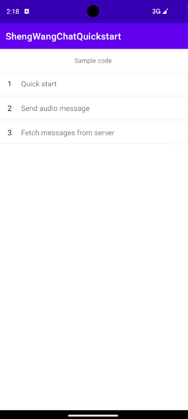

# API Example Android

## 简介

该仓库包含了使用 声网 Chat SDK for Android 的示例项目。



## 项目结构

此项目使用一个单独的 app 实现了多种功能。每个功能以 activity 的形式加载，方便你进行试用。

| 功能                                             | 位置                                                                                                                    |
| ------------------------------------------------ | ----------------------------------------------------------------------------------------------------------------------- |
| 基于 Shengwang Chat 的快速开始                                    | [MainActivity.java](https://github.com/Shengwang-Lab/Shengwang-Chat-API-Examples/blob/main/Chat-Android/app/src/main/java/io/agora/agorachatquickstart/MainActivity.java)                  |
| 从服务器拉取历史消息                               | [FetchMessagesFromServerActivity.java](https://github.com/Shengwang-Lab/Shengwang-Chat-API-Examples/blob/main/Chat-Android/app/src/main/java/io/agora/agorachatquickstart/FetchMessagesFromServerActivity.java)                  |
| 发送语音消息                                     | [SendAudioMessageActivity.java](https://github.com/Shengwang-Lab/Shengwang-Chat-API-Examples/blob/main/Chat-Android/app/src/main/java/io/agora/agorachatquickstart/SendAudioMessageActivity.java)                  |


## 如何运行示例项目

### 前提条件
- 您已[开启和配置即时通讯服务](https://im.shengwang.cn/docs/sdk/android/enable_im.html)。在console上注册用户名并获取token。
- 真实的 Android 5.1及以上 设备或 Android 虚拟机
- Android Studio (推荐最新版)
- JDK (1.8及以上)

### 运行步骤

1. 克隆本项目到本地
2. 在 Android Studio 中，打开 /Chat-Android/。
3. 将项目与 Gradle 文件同步。
4. 如果你想使用自己的 App Id 进行体验，你可以编辑 `Chat-Android/app/src/main/res/values/strings.xml` 文件。
   - 将 `your app id` 替换为你的 App Id。
   - 将 `user_name` 替换为你在console上注册的用户名。
   - 将 `chat_token` 替换为你在console上注册的用户名对应获取的token。
   ``` xml
    <string name="app_id">your app id</string>
    <string name="user_name">your username</string>
    <string name="chat_token">your chat token</string>
   ```
5. 构建项目，在虚拟器或真实 Android 设备中运行项目。

一切就绪。你可以自由探索示例项目，体验 SDK 的丰富功能。

## 反馈

如果你有任何问题或建议，可以通过 issue 的形式反馈。

## 参考文档

- [Shengwang Chat SDK 产品概述](https://im.shengwang.cn/docs/sdk/android/document_index.html)
- [Shengwang Chat SDK ApiReference](https://im.shengwang.cn/sdkdocs/chat1.x/android/annotated.html)

## 相关资源

- 查看我们的issue记录[FAQ](https://doc.shengwang.cn/faq/list).

- 深入了解声网 SDK 示例代码库以查看更多教程 [Shengwang SDK Samples](https://github.com/Shengwang-Lab)

- 查看声网使用案例获取更多复杂的实际应用场景 [Agora Use Case](https://github.com/AgoraIO-usecase)

- 在声网开发者社区可以找到社区维护的开源项目 [Shengwang Community](https://github.com/Shengwang-Lab)

- 如果集成中遇到任何问题可以在这里提问 [Stack Overflow](https://stackoverflow.com/questions/tagged/agora.io)

## 代码许可

示例项目遵守 MIT 许可证。
