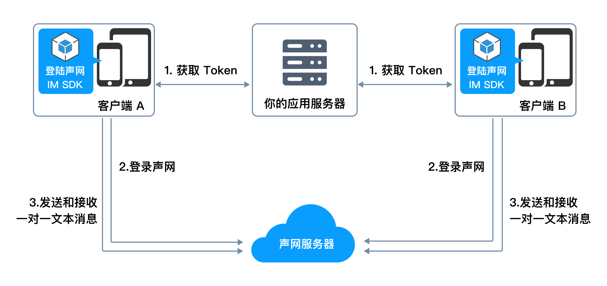
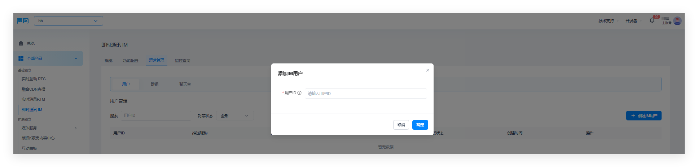
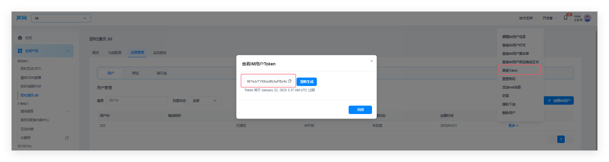

# API Example React-Native

_[中文](README.zh.md) | English_

# API Example React-Native

_[中文](README.zh.md) | English_

# Quick Start

<Toc />

This document introduces how to integrate the Instant Messaging React-Native SDK in a minimal way to send and receive one-on-one text messages in your app.

## Implementation Principle

The following diagram shows the workflow of sending and receiving one-on-one text messages on the client side.



## Prerequisites

Before integration, please ensure that the development and running environment of the app meets the following requirements:

- MacOS 12 or higher
- React-Native 0.66 or higher
- NodeJs 18 or higher

For iOS applications:

- Xcode 13 or higher and its related dependency tools.

For Android applications:

- Android Studio 2021 or higher and its related dependency tools.

If you encounter issues configuring the development or running environment, please refer to the [RN official website](https://reactnative.dev/).

### Other Requirements

A valid Instant Messaging IM developer account and App ID, see [Shengwang Console](https://console.shengwang.cn/overview).

## Project Setup

Create a React Native project and integrate it

1. Prepare the development environment according to the development system and target platform.
2. Open the terminal, navigate to the directory where you want to create the project, and enter the command to create a React Native project:

```sh
npx @react-native-community/cli init --skip-install --version 0.76 quick_start_demo
cd quick_start_demo
yarn set version 1.22.19
yarn
```

The created project name is `quick_start_demo`.

3. In the terminal command line, enter the following command to add dependencies:

```sh
yarn add react-native-shengwang-chat
```

4. Execute scripts on the target platform

Android:

None.

iOS:

```sh
cd ios && pod install && cd ..
```

## Register Instant Messaging IM Users

#### Create Users

Follow the steps below in the [Shengwang Console](https://console.shengwang.cn/overview) to create users:

1. Expand the dropdown in the upper left corner of the console and select the project that needs to enable Instant Messaging IM services.

2. Click on **All Products** in the left navigation bar.

3. Find **Instant Messaging IM** in the dropdown list and click it.

4. On the **Instant Messaging IM** page, go to the **Operation Management** tab.

5. Under the **Users** tab, click **Create IM User**.

6. In the pop-up dialog, configure the user-related parameters and click **Confirm**.



#### Get User Token

After creating a user, click **More** in the **Actions** column of the corresponding user in the user list, and select **View Token**.

In the pop-up dialog, you can view the user Token, and you can also click **Regenerate** to generate a new user token.



## Implement Sending and Receiving One-on-One Messages

It is recommended to open the folder `quick_start_demo` with `visual studio code`, open the file `App.js`, delete all content, and add [the following content](./App.js).

## Compile and Run the Project

Now you can start creating and running the project on the target platform.

Compile and run on iOS devices:

```sh
yarn run ios
```

Compile and run on Android devices:

```sh
yarn run android
```

Run the local service:

```sh
yarn run start
```

## Test Your App

Refer to the following code to test user registration, login, sending, and receiving messages.

1. Enter the username and password on a real device or emulator, and click **Register**.
2. Click **Login**.
3. Register and log in a new user on another real device or emulator.
4. On the first device or emulator, enter the username from the second device, edit the message, and click **Send** to receive the message on the second device.

You can also check the logs below to verify whether registration, login, and message sending were successful.

## More Operations

To ensure security, we recommend using the `username + password + token` method to create users. The token is generated on your app server for the client to obtain. When the token expires, you need to retrieve it again. For more details, see [Using Token Authentication](/sdk/server-side/token_authentication.html).
