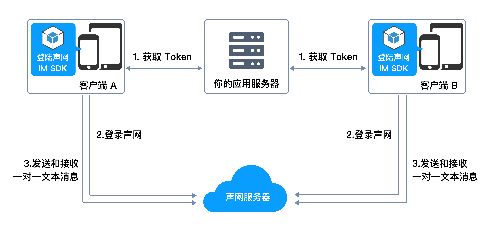

# API Example React-Native

_[English](README.md) | 中文_

# 快速开始

<Toc />

本文介绍如何极简集成即时通讯 React-Native SDK，在你的 app 中实现发送和接收单聊文本消息。

## 实现原理

下图展示在客户端发送和接收一对一文本消息的工作流程。



## 前提条件

集成前请确认 app 的开发和运行环境满足以下要求：

- MacOS 12 或更高版本
- React-Native 0.66 或更高版本
- NodeJs 18 或更高版本

对于 iOS 应用：

- Xcode 13 或更高版本及其相关的依赖工具。

对于 Android 应用：

- Android Studio 2021 或更高版本及其相关的依赖工具。

配置开发或者运行环境如果遇到问题，请参考 [RN 官网](https://reactnative.dev/)。

### 其他要求

有效的即时通讯 IM 开发者账号和 App ID，见 [声网控制台](https://console.shengwang.cn/overview)。

## 项目设置

创建一个 React Native 项目并将集成进去

1. 根据开发系统和目标平台准备开发环境。
2. 打开终端，进入需要创建项目的目录，输入命令创建 React Native 项目：

```sh
npx @react-native-community/cli init --skip-install --version 0.76 quick_start_demo
cd quick_start_demo
yarn set version 1.22.19
yarn
```

创建的项目名称为 `quick_start_demo`。

3. 在终端命令行，输入以下命令添加依赖：

```sh
yarn add react-native-shengwang-chat
```

4. 在目标平台执行脚本

Android：

无。

iOS：

```sh
cd ios && pod install && cd ..
```

## 注册即时通讯 IM 用户

#### 创建用户

在[声网控制台](https://console.shengwang.cn/overview)按照如下步骤创建用户：

1. 展开控制台左上角下拉框，选择需要开通即时通讯 IM 服务的项目。

2. 点击左侧导航栏的**全部产品**。

3. 在下拉列表中找到**即时通讯 IM** 并点击。

4. 在**即时通讯 IM** 页面，进入**运营管理**标签页。

5. 在**用户** 页签下，点击**创建 IM 用户**。

6. 在弹出的对话框中，配置用户相关参数，点击**确定**。


#### 获取用户 token

创建用户后，在用户列表点击对应的用户的**操作**一栏中的**更多**，选择**查看 Token**。

在弹出的对话框中，可以查看用户 Token，也可以点击**重新生成**，生成用户 token。


## 实现发送和接收单聊消息

建议使用 `visual studio code` 打开文件夹 `quick_start_demo`，打开文件 `App.js`，删除全部内容，并添加[如下内容](./App.js)

## 编译和运行项目

现在你可以开始在目标平台创建和运行项目。

编译运行 ios 设备：

```sh
yarn run ios
```

编译运行 android 设备：

```sh
yarn run android
```

运行本地服务

```sh
yarn run start
```

## 测试你的 app

参考以下代码测试注册账号，登录，发送和接收消息。

1. 在真机或模拟器上输入用户名和密码，点击 **注册**。
2. 点击 **登录**。
3. 在另一台真机或模拟器上注册和登录一个新用户。
4. 在第一台真机或模拟器上输入第二台上的用户名，编辑消息并点击 **发送**，在第二台机器上接收消息。

同时你可以在下方查看日志，检查注册，登录，发送消息是否成功。

## 更多操作

为了保证安全性，我们推荐使用 `username + password + token` 方式创建用户，token 在你的 app server 生成供客户端获取，当 token 过期时你需要重新获取。详见 [使用 Token 验证](/sdk/server-side/token_authentication.html)。
