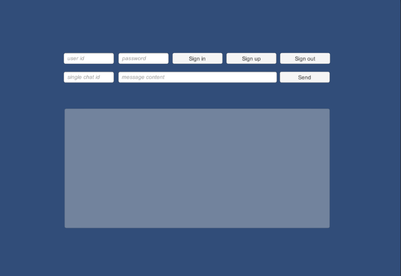

# API Example Unity

## 简介

该仓库包含了使用 ShengWang Chat Unity sdk 的示例项目。

## 项目结构

此项目使用一个单独的 app 实现了多种功能。

| Function   | Location  |
| --------------- | ------------------------ |
| Login, send and receive message | [ TestCode.cs ](https://github.com/Shengwang-Lab/Shengwang-Chat-API-Examples/blob/main/Chat-Unity/chat_unity_quickstart/Assets/Scripts/TestCode.cs) |

## 如何运行示例项目

### 前提条件

*运行项目的必要条件。*

- *[Unity Hub](https://unity.com/download)*
- *Unity Editor 2019.4.28 or later*
- *Target platform*
    - iOS:
        - iOS version 10
        - Xcode 14.0 or later
    - macOS:
        - Xcode 12.1 or later
        - macOS 12.0 or later
    - Android:
        - Android 4.1 or later
        - Android Studio 3.0 or later
    - Windows:
        - Windows 10 or later

### 运行步骤

1. *将此项目克隆到本地*
2. *使用Unity hub打开项目: Shengwang-Chat-API-Examples/Chat-Unity/chat_unity_quickstart*
3. *集成ShengWang Chat Unity SDK*
   > 下载 [ ShenngWang Chat Unity SDK](https://im.shengwang.cn)

   > 在 Unity Editor里, 点击 Assets > Import Package > Custom Package....

4. *为项目添加示例代码*

   > 此项目只包含一个框架，没有具体实现。
   需要添加示例代码. 参考 [ShengWang Chat Unity sdk快速开始](https://im.shengwang.cn/docs/sdk/unity/quickstart.html)

5. *运行和测试你的项目*

一切就绪。你可以自由探索示例项目，体验 SDK 的丰富功能。

## 反馈

如果你有任何问题或建议，可以通过 issue 的形式反馈。

## 参考文档

- [ShengWang Chat Unity SDK 产品概述](https://im.shengwang.cn/docs/sdk/unity/document_index.html)
- [ShengWang Chat Unity SDK API 参考](https://im.shengwang.cn/sdkdocs/chat1.x/unity/)

## 相关资源

- 你可以先参阅[常见问题](https://doc.shengwang.cn/faq/list)
- 如果你想了解更多官方示例，可以参考[Shengwang SDK Samples](https://github.com/Shengwang-Lab)
- 如果你想了解声网 SDK 在复杂场景下的应用，可以参考[官方场景案例](https://github.com/AgoraIO-usecase)
- 如果你想了解声网的一些社区开发者维护的项目，可以查看[Shengwang Community](https://github.com/Shengwang-Lab)
- 若遇到问题需要开发者帮助，你可以到[Stack Overflow](https://stackoverflow.com/questions/tagged/agora.io)提问

## 代码许可

示例项目遵守 MIT 许可证。
